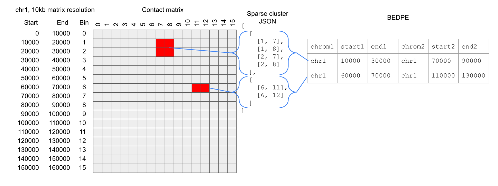

bedpe-to-clusters
=================

BEDPE to hic3defdr sparse cluster JSON

Diagram
-------

Quick start
-----------

### Dependencies

This small example requires only `pandas` - a `requirements.txt` file is
provided but is likely excessive.

    pip install pandas

### Inputs/outputs

The example input file is `loops.bedpe`, provided directly in this repo.

The output produced from this input is `chr1_clusters.json` and
`chr2_clusters.json`, committed to this repo.

### Run

To run the script:

    python bedpe_to_clusters.py

Walkthrough
-----------

### Key functions

`bedpe_to_clusters()` groups the input BEDPE file into cis loops on each
chromosome, then calls `bedpe_row_to_cluster()` once for each row in each group.

`NumpyEncoder` and `save_clusters()` are copied out of `hic3defdr.util.clusters`
to avoid a dependency on `hic3defdr` in this minimal example, but if you have
`hic3defdr` installed you can delete them both and replace them with

    from hic3defdr.util.clusters import save_clusters()
